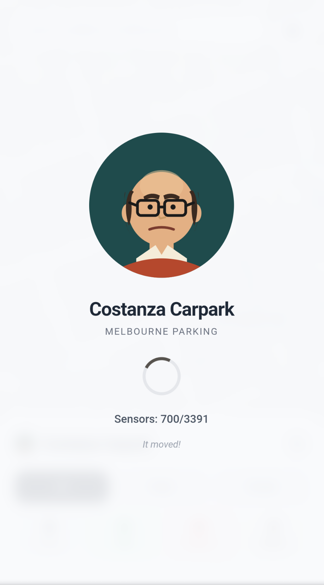
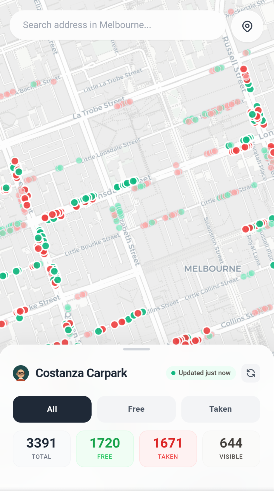
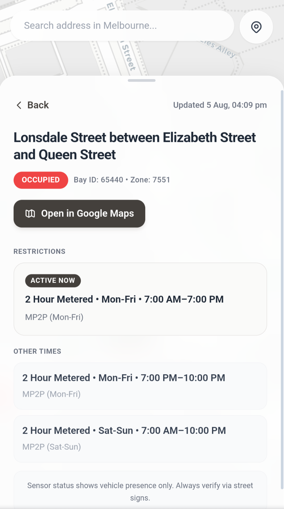
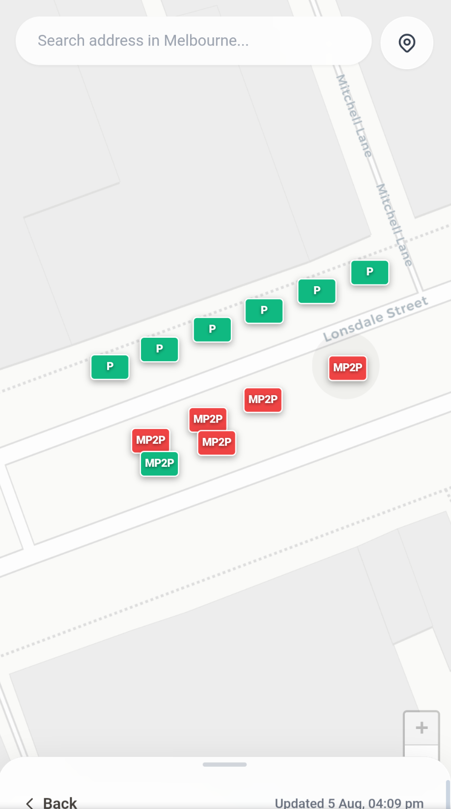
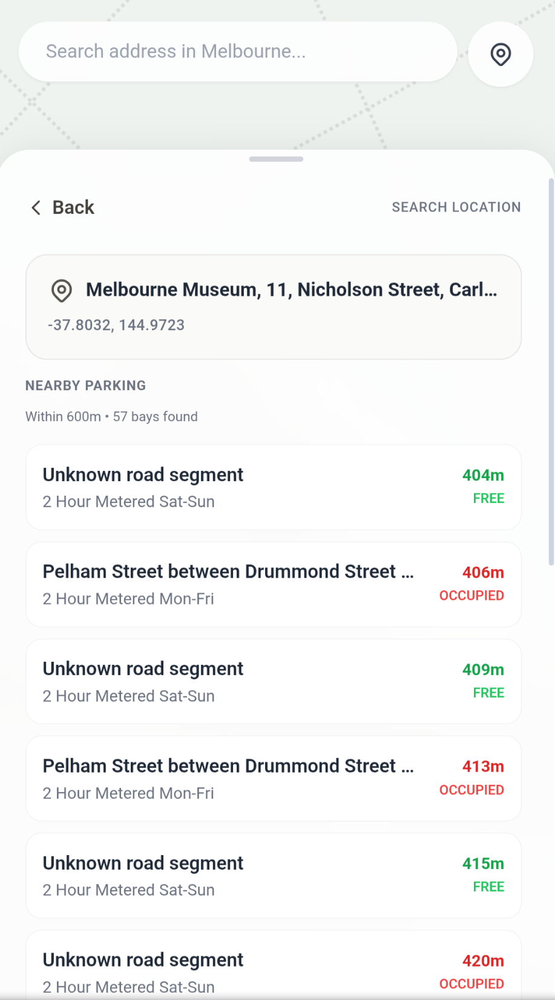

# Costanza Parking

Melbourne Street Parking 

> I've become physically attracted to the parking sensor.

## Featuers

<table>
  <tr>
    <td align="center">
       
      <b>Loading screen while parking data is fetched</b>
    </td>
    <td align="center">
       
      <b>Parking sensor-based map markers</b>
    </td>
  </tr>
  <tr>
    <td align="center">
       
      <b>Parking spot details</b>
    </td>
    <td align="center">
       
      <b>Parking restriction markers when zoomed in</b>
    </td>
  </tr>
  <tr>
    <td align="center" colspan="2">
       
      <b>Parking spots near the searched location</b>
    </td>
  </tr>
</table>

## Tech

All done in a single HTML file for fun and no profit. 

The APIs used have data that is pretty meh. A lot of the sensor data is stale. This is reflected in app with warnings and opaque map markers.
